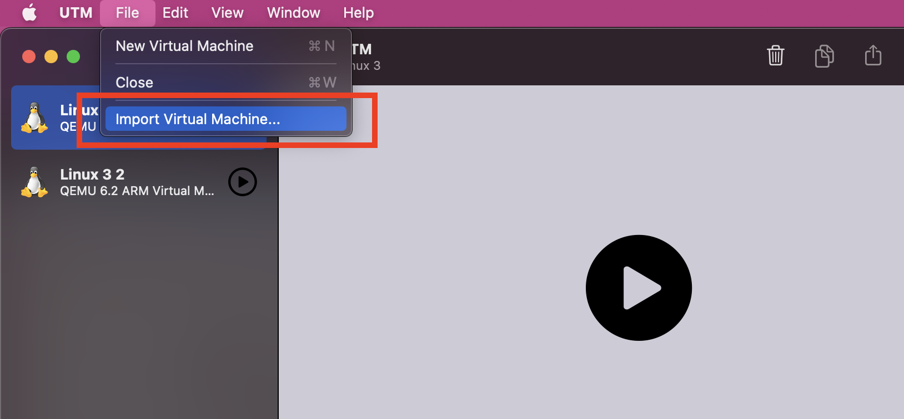

# Singularity Containers on M1

This is a repository containing a ready-to-use environment for singularity in arm64 (M1). It has been prepared specifically for the [SKA SRC  training on containers  event](https://gitlab.com/ska-telescope/src/ska-src-training-containers) and allows you the use of [singularity containers](https://sylabs.io/singularity) with Apple's M1 architecture. 

- [Singularity Containers on M1](#singularity-containers-on-m1)
  * [Install UTM for Apple M1](#install-utm-for-apple-m1)
  * [Download and unzip the pre-build UTM image ready to use.](#download-and-unzip-the-pre-build-utm-image-ready-to-use)
- [Import UTM image from the UTM application](#import-utm-image-from-the-utm-application)
- [Start the image](#start-the-image)
- [Connect to the environmente using SSH](#connect-to-the-environmente-using-ssh)
- [Change keyboard layout](#change-keyboard-layout)
- [Building you own container on singularity for M1](#building-you-own-container-on-singularity-for-m1)
- [Acknowledgments](#acknowledgments)

<small><i><a href='http://ecotrust-canada.github.io/markdown-toc/'>Table of contents generated with markdown-toc</a></i></small>


## Install UTM for Apple M1

Click here: [UTM for M1](https://mac.getutm.app/)

Download it and then install it.

## Download and unzip the pre-build UTM image ready to use.

Click here to [download this image](https://drive.google.com/file/d/1STHZq81HIRFit2en5jzAPaHSLfPc7tVB/view?usp=sharing).

This is an image created using Ubuntu 20.04 for ARM 64 Architecture.

After that, unzip the file downloaded (from 3GB to 6GB).

# Import UTM image from the UTM application

Open UTM application, then click on the menu "File" and then "Import", select the image `skatraining-singularity.utm`.



# Start the image

Click on the recently imported image and then click `>` to start.

After that you will see login screen. 

Use the following credentials:

- username: **ska**
- passwoord: **ska**


# Connect to the environmente using SSH.

Connecting via SSH is a better option than directly using the shell that appears from the screen when starting the Virtual Machine. 

To do that, open a Terminal in your host system and type the following:

```
ssh -p 22022 ska@localhost
```

and you have to use the following credentials:

- username: **ska**
- passwoord: **ska**


# Change keyboard layout

Because the image was built on my machine, in the installation I used my local keyboard layout, so to use your own keyboard layout (FR, DE, UK, ...), to do it you can type the following:

```
sudo dpkg-reconfigure keyboard-configuration
```

And then select your keyboard layout. Then you have to reboot the virtual machine by typing: ``sudo reboot``

# Building you own container on singularity for M1

**Note you can use all Singularity and Docker containers from their Cloud Hubs, but there must be containers on the ARM64 architecture. Many of the containers are already ported to ARM64, but there are still many that have not been migrated to this new architecture.**

Here we guide you through the process of creating your own container that will work perfectly for ARM64 architectures.

First, clone this repository:

````
git clone https://github.com/manuparra/singularitycontainers-on-m1-arm64.git
````

Then type:

```
cd singularitycontainers-on-m1-arm64
```

After that you can build an example container (see the code [here](./lolcow.def) ):

```
sudo singularity build lolcow.sif lolcow.def
```

After this process you will see a file named: ``lolcow.sif``, now is time to run it:

```
singularity run lolcow.sif 
```

You will see the following:

````
 _________________________________________
/ Best of all is never to have been born. \
\ Second best is to die soon.             /
 -----------------------------------------
        \   ^__^
         \  (oo)\_______
            (__)\       )\/\
                ||----w |
                ||     ||


````

The next step is to build a container that has more functionalities, in this case we are going to create a container that we can use later to improve it and create, for example our python code encapsulated in containers. 

First, build the container (you can see how it is created from a definition file [here](myplottingapp.def)):

```
sudo singularity build myplottingapp.sif myplottingapp.def 
```

After this process your container is ready to use by typing:


```
singularity run myplottingapp.sif testfile.png

```

Now, you can see a file named ``testfile.png``.

```
-----------------------------------------------
SKA training: Git and Containers
Plot generated in testfile.png file.
-----------------------------------------------
```

Another way to interact with the container is to connect to the container and open a shell, for this, we can use the following:

```
singularity shell myplottingapp.sif
```

Then, if you want to go back to the host, type: ``exit``


# Acknowledgments

Mateusz Malenta and Alex Clarke
